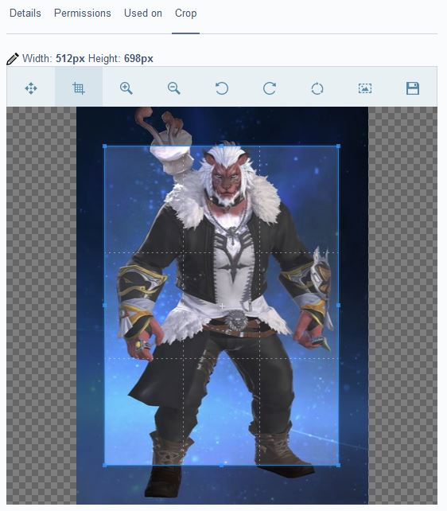
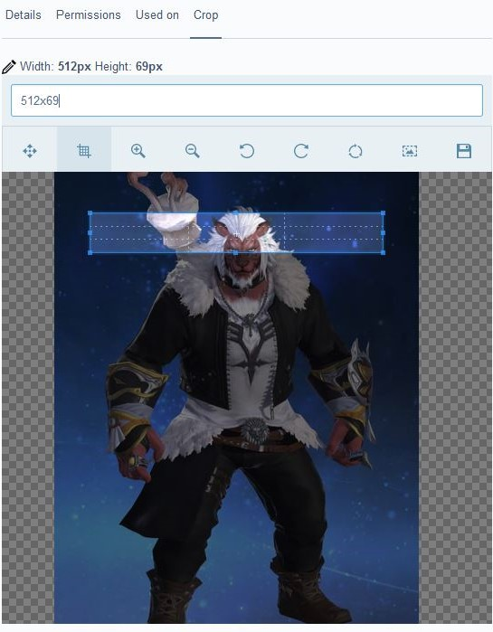
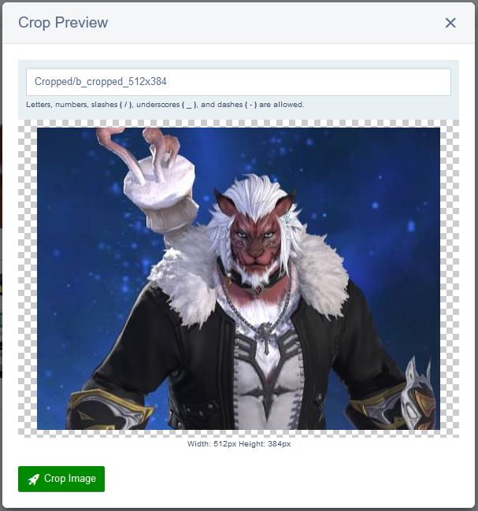
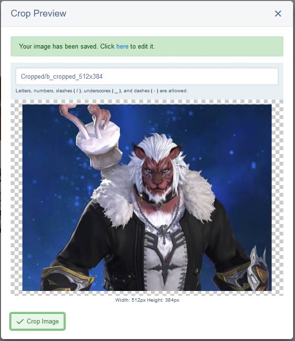
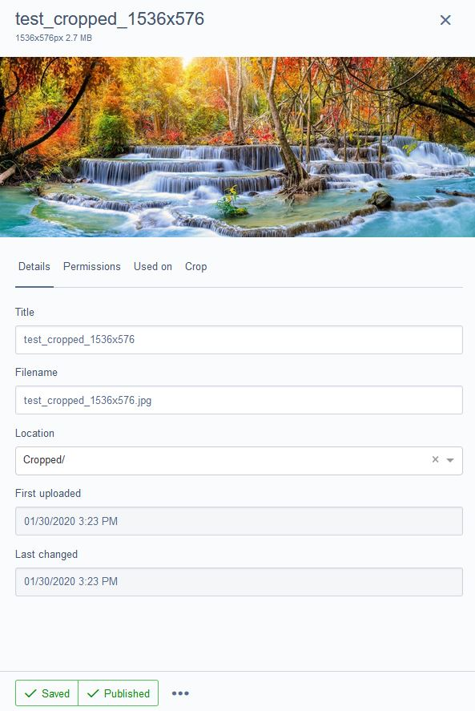

Image Cropper Field
=================

Adds the ability to crop images from within the silverstripe file section.

## Requirements

- SilverStripe 4.4.x

## Installation

Installation is supported via composer only

```sh
composer require webbuilders-group/silverstripe-image-crop-field
```

- Run `dev/build?flush=all` to regenerate the manifest

## Usage

There is no need to configure anything. Once you have it install and have run `dev/build?flush=all`, you can begin
cropping images right away from with-in the file section of the cms.

## Features and Overview
Image Cropper Field has a wide array of tools that will help any CMS Admin crop their images and limit the need to use external tools like Photoshop.





#Some of the tools:
- cropper dimensions tool


- move tool


- cropper tool


- zoom tools
 

- image rotating tools
 

- reset tool


- aspect ratio setting tool


Image Cropper Field will not overwrite the current image and instead creates a new image. The filename of the generated image is determined by the filename of the current image. The new image is saved into the `Cropped` folder by default. Both of these settings can be changed before you press the `Crop Image` button. 

Note, the cropped image should be saved to a sub-folder. If no sub-folder is selected, it will default to the `Cropped` folder.



Once it has generated the new image, a green alert will be shown along with a link to your new image; However, this link will, currently, not be shown when you are using this field from the `file Insert Form`.



Once the link is clicked, you will be taken to your new image.



More features/tools to come in version 2:
- image flip tools
- ability to download your new cropped before clicking the `Crop Image` button.

## Reporting an issue

When you're reporting an issue, please ensure you specify what version of SilverStripe you are using i.e. 4.4.4. Also, be sure to include any JavaScript or PHP errors you receive. 

For PHP errors, please ensure you include the full stack trace. Also, please include your implementation code as well as how you produced the issue. You may also be asked to provide some of the classes to aid in re-producing the issue. Stick with the issue, remember that you seen the issue not the maintainer of the module so it may take a lot of questions to arrive at a fix or answer.

## FAQ
Q: I can't find my image after creating it in the `file Insert Form`. Where is my new image?
A: Your new image will be saved to the folder you selected or to the default folder `Cropped`. You will have to, currently, refresh the page and open the insert image window again to get the image to show up. 

Q: How do I change the folder the image saves too?
A: In the image below, we can see the image's new name will be `Cropped/b_cropped_512x384`. The slashes in the file name determine which folder the image will be saved too. We can see that it will save into the `Cropped` folder. 

If we wanted to save it into a different folder, we simple change the `Cropped` like so `newFolder/b_cropped_512x384` this will now save it into a folder called `newFolder` in the root of the file system.

If we wanted to save it into `newFolder > subFolder` we simple have to type `newFolder/subFolder/b_cropped_512x384`


Q: Why are there `\` in the new filename field before I click `Crop Image`?
A: 
