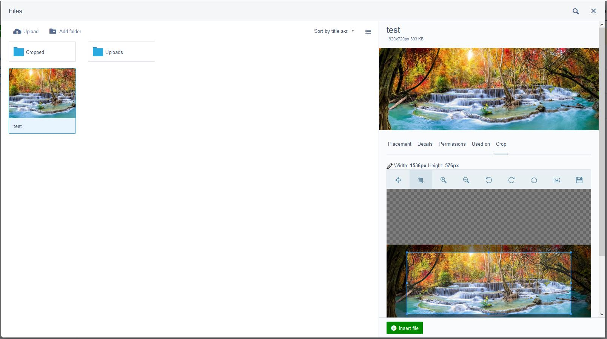

Image Cropper Field
=================

Adds the ability to crop images from within the Silverstripe file section.

## Requirements

- Silverstripe Asset Admin ~1.4 | ~2.0 | ~3.0

## Installation

Installation is supported via composer only

```sh
composer require webbuilders-group/silverstripe-image-cropper-field
```

- Run `dev/build?flush=all` to regenerate the manifest

## Setup

There is nothing to configure. Once you install and run `dev/build?flush=all`, you can begin cropping images right away from within the file section of the CMS.

## Features and Overview
Image Cropper Field has a wide array of tools that will help any CMS Admin crop their images and limit the need to use external tools like Photoshop.


**The tools:**
- cropper dimensions tool


- move tool


- cropper tool


- zoom tools

 

- image rotating tools

 

- reset tool


- aspect ratio setting tool


Image Cropper Field will not overwrite the current image and instead will create a new image. The filename of the new image is determined by the filename of the current image. The new image is saved into the `Cropped` subfolder. The name of the new image can be changed before you click the  `Crop Image` button.


Once it has created the new image, a green alert will be shown along with a link to your new image; However, this link will, currently, not be shown when you are using this field from the `file Insert Form`.


Once the link is clicked, you will be taken to your new image.


**More features/tools to come in version 2:**
- image flip tools
- ability to download your new cropped image before clicking the `Crop Image` button.

## Reporting an issue

When you are reporting an issue, please ensure you specify what version of Silverstripe you are using i.e. 4.4.4. Also, be sure to include any JavaScript or PHP errors you receive.

For PHP errors, please ensure you include the full stack trace. Also, please include your implementation code as well as how you produced the issue. You may also be asked to provide some of the classes to aid in re-producing the issue. Stick with the issue, remember that it was you who saw the issue not the maintainer of the module so it may take a lot of questions to arrive at a fix or answer.

## FAQ
**Q: I can't find my image after creating it in the `file Insert Form`. Where is my new image?**

**A:** Your new image will be saved to the subfolder named `Cropped`. You will have to, currently, refresh the page and open the insert image window again to get the image to show up when cropping from the `file Insert Form`.

**Q: How do I change the folder the image saves too?**

**A:** In this current version, you cannot change where the image is saved too. We will be trying to add it in a future release.

**Q: You keep mentioning `file Insert Form`, where is this form? Do I use it?**

**A:** The `file Insert Form` can be found when you interact with the `Files` popup window, so either by clicking on the `insert from files` button on a WYSIWYG editor or by clicking the `browse` button/link on an upload field. The image below is the `file Insert Form` that is referred too.



**Q: Can I use this field on a page or a dataobject?**

**A:** Currently this field is designed only to be used in the file system of the CMS and the `file Insert Form`. There are plans to allow this field to be used on pages/dataobjects, and it will most likely come in version 2.
